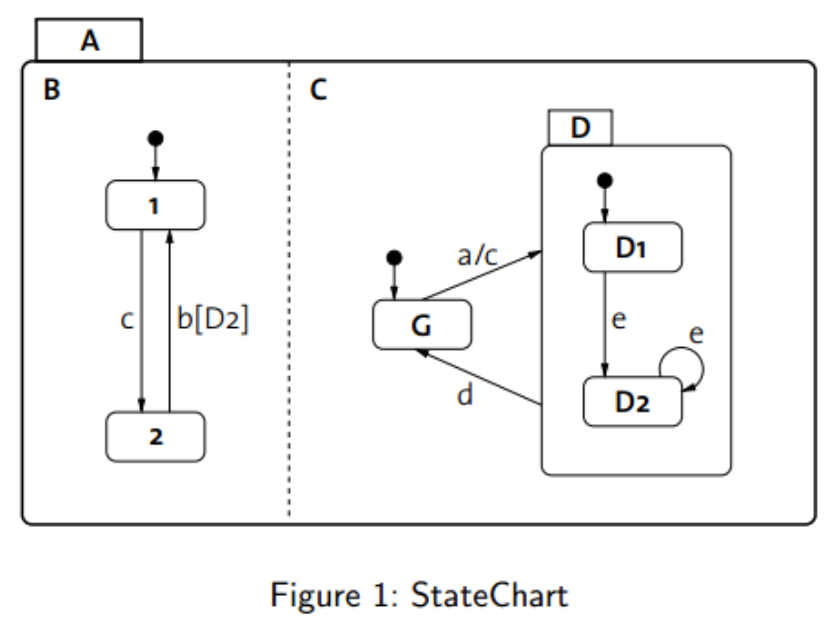
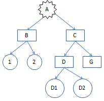
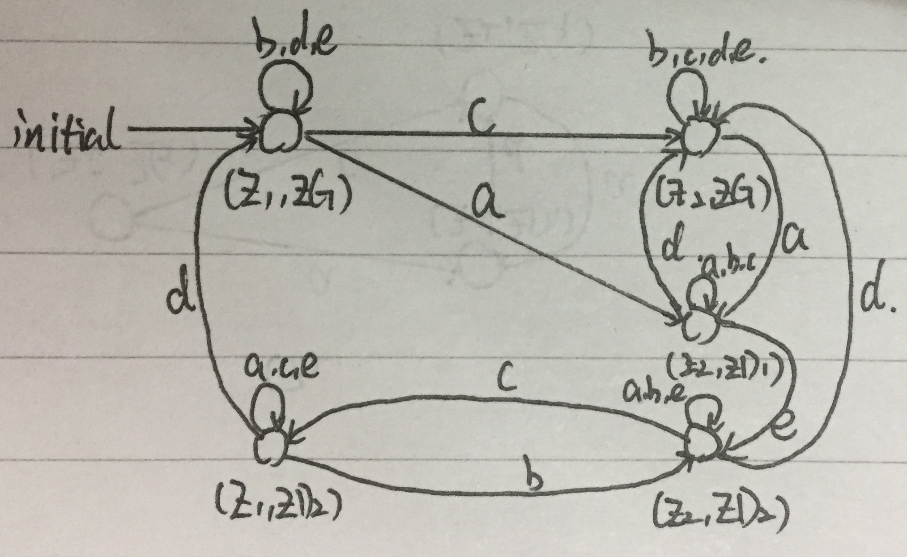
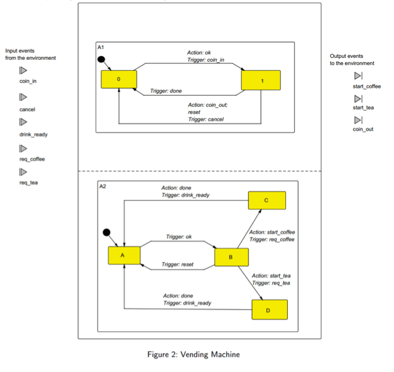

##嵌入式系统导论实验报告
-------

|  姓名  |  学号  |  班级  |  电话  |  邮箱  |
| :--: | :--: | :--: | :--: | :--: |
|   何颂恒   |   15352109   |   1505   |   13434284044   |   toddheadchan@gmail.com   |

-----

##### 1. What are the important extensions of the StateChart modl in comparison to an ordinary Finite state machine (FSM)?

The most important extension is that the StateChart can solve multiple states at the same time while the ordinary Finite state machine can only solve one state at every time.

##### 2. What are the disadvantages of the StateChart formalism

##### 3. Given the StateChart in Figure 1. Draw the state sapce of the StateChart as a tree, which shows the hierachy of states and denotes the state types (basic state, sequential states, and parallel states)

<br>

The StateChart tree is as shown:<br>


##### 4. How would you formally compute the set of states? Compute the set of states for the hierarchical automata which is defined by the StateChart from Fig.1

```
ZA = ZB x ZC
= (Z1 ∪ Z2) x (ZD ∪ ZG)
= (Z1 ∪ Z2) x ((ZD1 ∪ ZD2) ∪ ZG)
```

##### 5. The automaton defined by the StateChart from Fig.1 passes through a number of states, when external events are applied. Show the sequence of state that are passed through, starting from the initial state, for the following sequence of events: a,b,e,b,d,b. Use a table notation.

|  State  | ZA | ZB | ZC | ZD |
| :--: | :--: | :--: | :--: | :--: |
| original | ZB,ZC | Z1 | ZG | unactive |
| step 1: a | ZB,ZC | Z2 | ZD | ZD1 |
| step 2: b | ZB,ZC | Z2 | ZD | ZD1 |
| step 3: e | ZB,ZC | Z2 | ZD | ZD2 |
| step 4: b | ZB,ZC | Z1 | ZD | ZD2 |
| step 5: d | ZB,ZC | Z1 | ZG | unactive |
| step 6: b | ZB,ZC | Z1 | ZG | unactive |

##### 6. Draw a finite state machine which is equivalent to the StateChart from Fig. 1. Minimize the number of states.



##### 7. The StateChart model of a simplified vending machine is shown in Figure 2.
##### <li>Describe the trace of transitions occurring when the user inserts a coin and orders a tea</li>
##### <li>The control of the vending machine has a bug that allows the user to cheat. Describe the trace of transitions that illustrate the bug.</li>
##### <li>Draw the correspongding StateChart that fixds the bug</li>

<br>

<li>
1. When a user comes, the machine is at the original state: A1 is in state 0 and A2 is in state A<br>
2. When he insert a coin, the signal _coin\_in_ triggered and the state of A1 becomes 1, and send the action _OK_, which drive the state of A2 to B. <br>
3. The user choose tea, so the event _req\_tea_ is triggered and the state of A2 becomes D, and sent out the action _start\_tea_.<br>
4. When the drink is ready, the action _drink\_ready_ is sent and the state of A2 becomes A. The action _done_ is also send and the state of A1 becomes 0.
</li>

<li>
When a user order a tea as the step 3 above, A1 is in state 1 and A2 is in state D. During the time the drink is preparing, if the user send an action _cancel_, then A1 will be in the state of 0, and will give out the coin. But when the drink is ready, A2 will transform to state A and the drink will be give out. Therefore, the user can get a drink without paying money.
</li>

<li></li>
