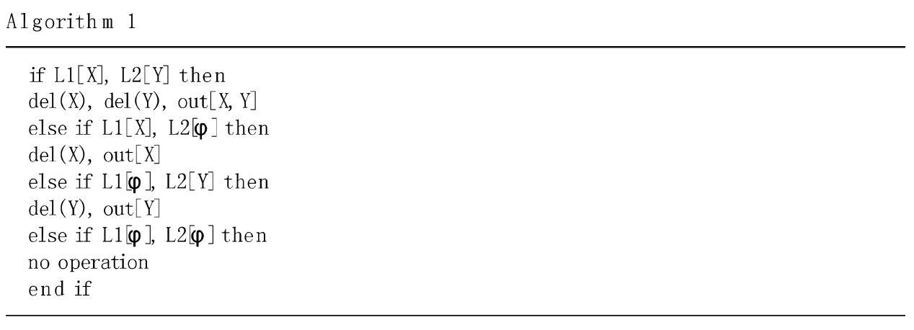
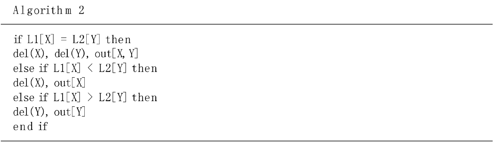
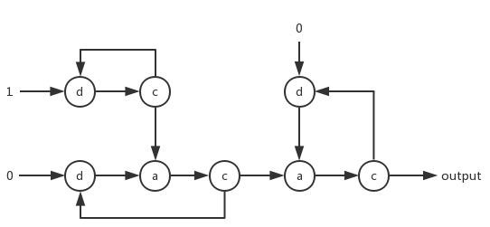
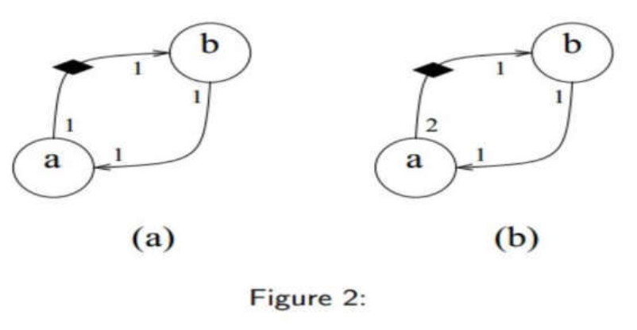
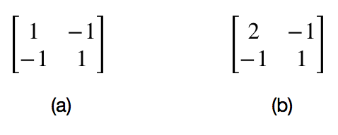
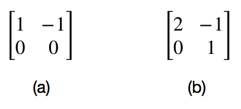
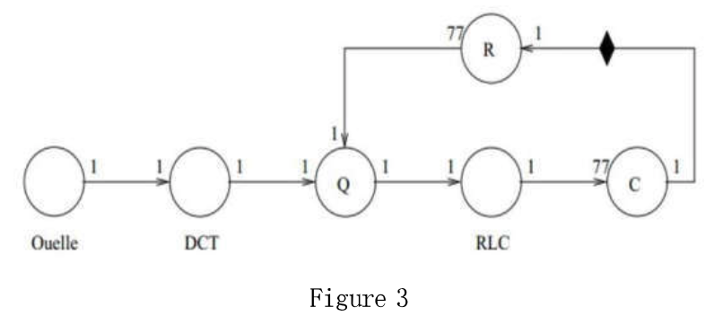
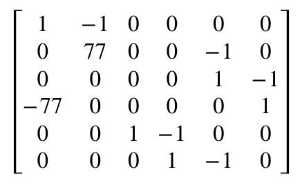

##嵌入式系统导论实验报告
-------

|  姓名  |  学号  |  班级  |  电话  |  邮箱  |
| :--: | :--: | :--: | :--: | :--: |
|   何颂恒   |   15352109   |   1505   |   13434284044   |   toddheadchan@gmail.com   |

-----

##### 1.1. For two algorithms above,
##### <li>Examine the determinacy of these two algorithms.  Prove or disprove your conclusion</li>
##### <li>Examine the fairness of these two algorithms</li>

 
 

<li>
For the first algorithm, it does not have determinacy. For the output result will change even regardless of the arrival order of the input sequence. If the sequence L1 arrive first, the output will have continous data from L1 in the beginning, while if the sequence L2 arrive first, the output will have continous data from L2 in the beginning. So the first algorithm has not determinacy. 
For the second algorithm, it has the character of determinacy. Because every time the algorithm needs both data from sequence L1 and sequence L2. So the arriving time of data will not affect the output of the algorithm
</li>

<li>
For the first algorithm, whenever a data comes, even when the other sequence is empty, the latest data can also be solved and output. So the first algorithm has the character of fairness. 
For the second algorithm, it has no fairness. Because if one of the sequences comes a data while the other one is empty, the latest data will not be solved.
</li>

##### 1.2 Draw a kahn process network that can generate the sequence of quadratic numbers n(n+1)/2. Use basic processes that add two numbers, multiply two numbers, or duplicate a number. You can also use innitialization processes that generate a constant and then simply forward their input. Finally, you can use a sink process.

 
In the graph, node _d_ means a constant peocess, node _c_ means a duplicate process, node _a_ means a add two number process. _Output_ means the output channel.

##### 2.Given the SDF graph in Figure 2
##### <li>Determine the topological matrix of these two SDF graphs</li>
##### <li>Are these two graphs consistent?</li>
##### <li>If yes, determine the number of firings of each node, which leads for a periodic execution. How often each node must fire thereby at least?</li>

<li></li>
 

<li></li>
 
The rank of matrix a is 1, so it is consistent
The rank of matrix b is 2, so it is not consistent

<li>
For matrix a, the firing number is: a=1,b=1 
</li>

##### 3.Given the SDF graph in Figure 3
##### <li>Determine the topological matrix of these this SDF graph</li>
##### <li>Examine the consistency</li>
##### <li>Determine the relative number of node firings, which leads for periodic execution at node firings</li>

<li></li>

<li> The rank of the matrix is 5, so it is consistent
</li>

<li>The firing: C=1 , R=1 , Ouelle=77 , DCT=77 , Q=77 , RLC=77 </li>